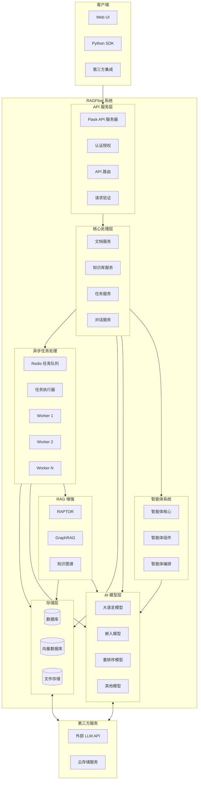

```mermaid
flowchart TB
    subgraph Client["客户端"]
        WebUI["Web UI"]
        SDK["Python SDK"]
        ThirdParty["第三方集成"]
    end
    
    subgraph RAGFlow["RAGFlow 系统"]
        subgraph API["API 服务层"]
            APIServer["Flask API 服务器"]
            Auth["认证授权"]
            APIRoutes["API 路由"]
            Validation["请求验证"]
        end
        
        subgraph Core["核心处理层"]
            DocumentService["文档服务"]
            KBService["知识库服务"]
            TaskService["任务服务"]
            ConversationService["对话服务"]
        end
        
        subgraph AsyncTask["异步任务处理"]
            TaskQueue["Redis 任务队列"]
            TaskExecutor["任务执行器"]
            Worker1["Worker 1"]
            Worker2["Worker 2"]
            WorkerN["Worker N"]
        end
        
        subgraph Storage["存储层"]
            Database[(数据库)]
            VectorStore[(向量数据库)]
            FileStorage[(文件存储)]
        end
        
        subgraph AI["AI 模型层"]
            LLM["大语言模型"]
            EmbeddingModel["嵌入模型"]
            RerankModel["重排序模型"]
            OtherModels["其他模型"]
        end
        
        subgraph Agent["智能体系统"]
            AgentCore["智能体核心"]
            Components["智能体组件"]
            Canvas["智能体编排"]
        end
        
        subgraph RAG["RAG 增强"]
            RAPTOR["RAPTOR"]
            GraphRAG["GraphRAG"]
            KnowledgeGraph["知识图谱"]
        end
    end
    
    subgraph ThirdPartyServices["第三方服务"]
        ExternalLLM["外部 LLM API"]
        CloudStorage["云存储服务"]
    end
    
    %% 连接线
    Client --> API
    API --> Core
    Core --> AsyncTask
    Core --> Storage
    AsyncTask --> Storage
    AsyncTask --> AI
    Core --> AI
    AI <--> ThirdPartyServices
    Storage <--> ThirdPartyServices
    Core --> Agent
    Agent --> AI
    AsyncTask --> RAG
    RAG --> Storage
    RAG --> AI
```

注意：这是一个Mermaid格式的架构图描述。您可以使用Mermaid渲染工具（如VS Code的Mermaid预览插件、Mermaid Live Editor等）将其渲染为图像，然后保存为PNG格式。
